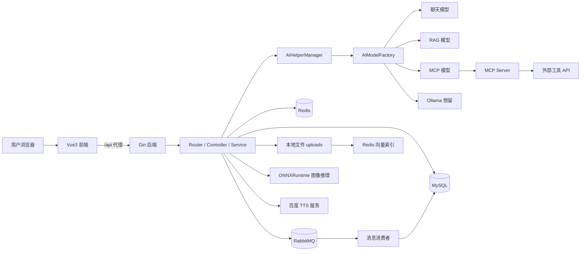
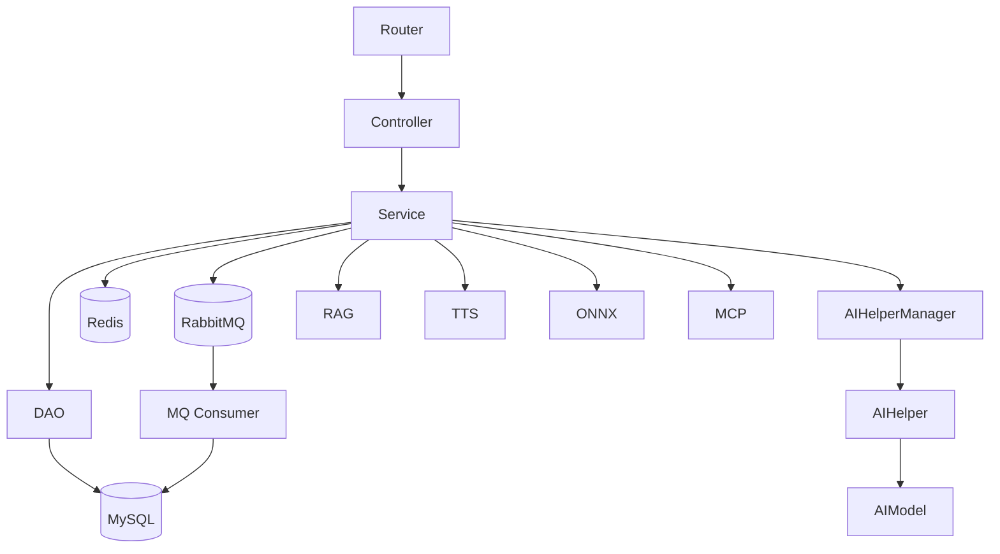
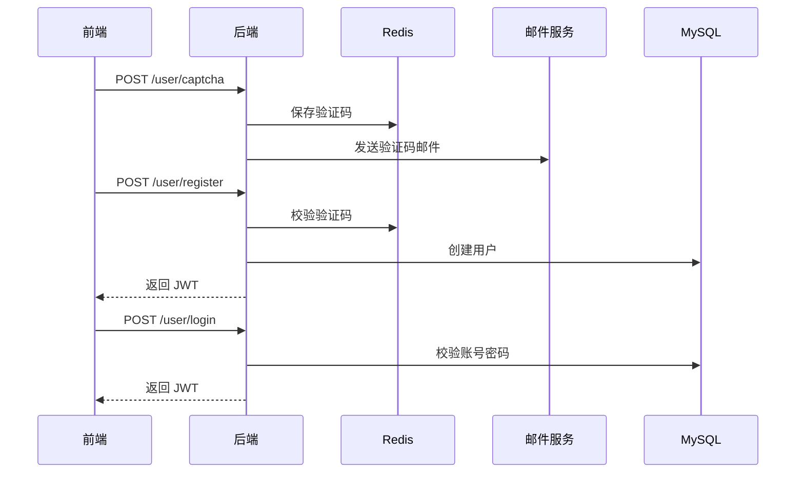
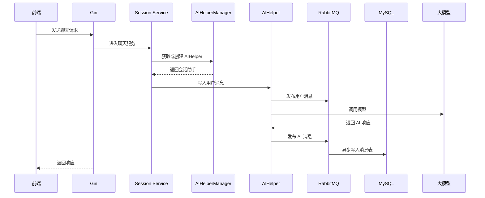
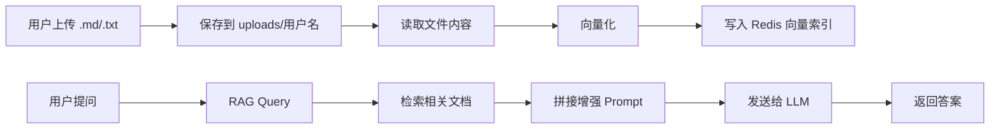
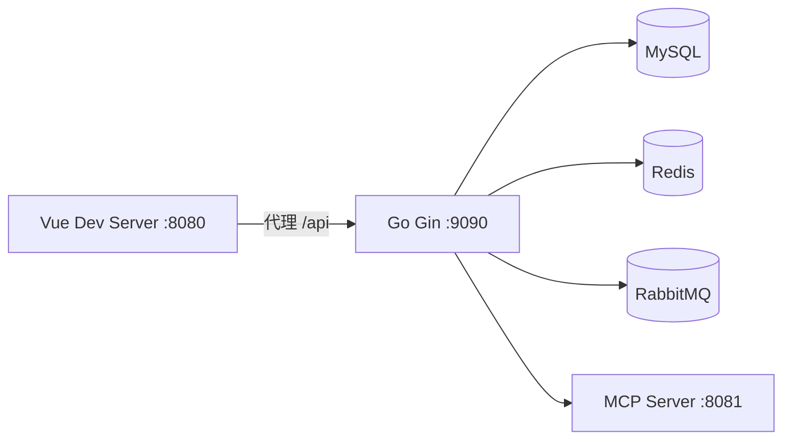
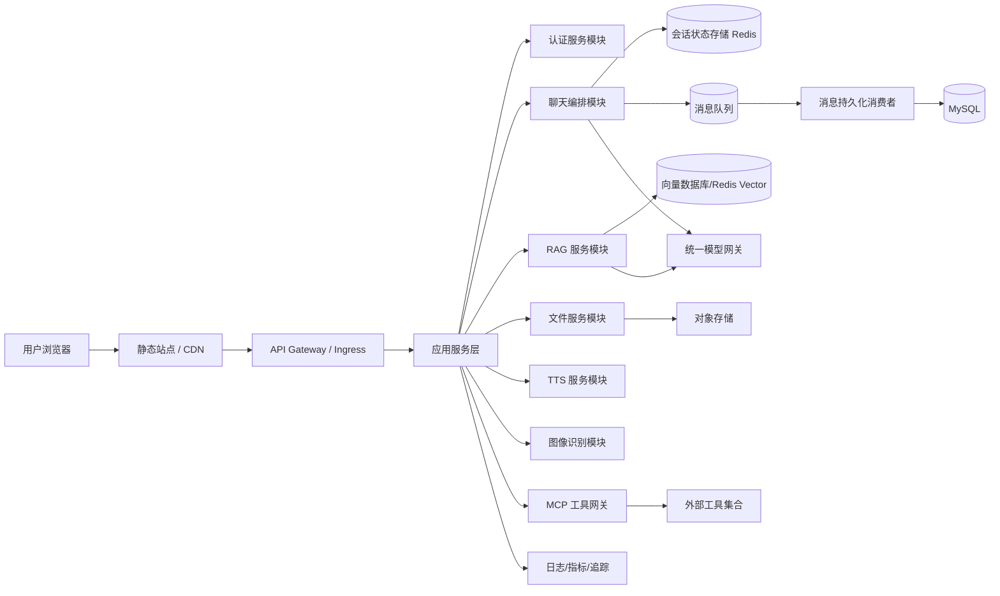

# GopherAI 架构设计说明

## 1. 文档目标

本文档用于沉淀 `GopherAI` 项目的整体架构设计，统一描述以下内容：

- 项目现状架构与版本演进关系
- 技术栈选型与核心依赖
- 系统模块划分与职责边界
- 核心业务流程与数据流转路径
- 开发、测试、生产环境部署形态
- 当前架构问题与未来目标架构
- 分阶段改造路线图

本文档以 `GopherAI-v2` 作为当前主分析对象，`GopherAI-v1` 作为历史版本与压测能力参考。

---

## 2. 项目概览

`GopherAI` 是一个以 Go 为后端、Vue 3 为前端的 AI 应用平台，围绕“多会话 AI 对话”构建，并逐步扩展出图像识别、RAG、TTS、MCP 等多模态能力。

仓库当前采用双版本并存模式：

- `GopherAI-v1`
  - 基础能力版本
  - 提供用户体系、AI 对话、SSE 流式输出、RabbitMQ 异步落库、图像识别
  - 保留压测模式与基线接口
- `GopherAI-v2`
  - 当前主线版本
  - 在 `v1` 基础上新增 RAG、TTS、MCP、文件上传等能力
  - 目录组织更清晰，更接近企业级分层单体架构

从系统形态上看，当前并不是严格意义上的微服务，而是：

- 单仓库
- 单体后端服务
- 单体前端应用
- 多外部基础设施依赖

即典型的“分层单体 + 基础设施集成”架构。

---

## 3. 版本演进关系

### 3.1 演进方向

项目的整体演进路径可以概括为：

1. 从基础 AI 聊天系统起步
2. 增强会话管理与上下文记忆
3. 引入消息队列进行异步削峰
4. 扩展多模态能力
5. 尝试将外部工具能力通过 MCP 纳入模型上下文

### 3.2 演进对照

| 维度 | GopherAI-v1 | GopherAI-v2 |
|---|---|---|
| 用户注册/登录 | 支持 | 支持 |
| JWT 鉴权 | 支持 | 支持 |
| AI 对话 | 支持 | 支持 |
| SSE 流式输出 | 支持 | 支持 |
| RabbitMQ 异步消息落库 | 支持 | 支持 |
| 图像识别 | 支持 | 支持 |
| RAG | 不支持 | 支持 |
| 文件上传 | 不支持 | 支持 |
| TTS | 不支持 | 支持 |
| MCP | 不支持 | 支持 |
| 压测能力 | 支持 | 未迁移 |

---

## 4. 整体技术栈

## 4.1 后端

- 语言：Go 1.24
- Web 框架：Gin
- ORM：GORM
- 配置：TOML
- 鉴权：JWT
- 邮件：SMTP + `gomail`
- UUID：`google/uuid`

## 4.2 AI 能力层

- 大模型接入框架：EINO
- OpenAI/兼容接口模型：通过 `eino-ext/components/model/openai`
- Ollama：保留扩展接口
- RAG 向量化：阿里百炼兼容 Embedding
- MCP：`mark3labs/mcp-go`

## 4.3 数据与中间件

- 关系型数据库：MySQL
- 缓存：Redis
- 向量检索：Redis + RediSearch Vector Index
- 消息队列：RabbitMQ

## 4.4 多模态能力

- 图像识别：ONNXRuntime + MobileNetV2
- 文本转语音：百度 TTS API

## 4.5 前端

- 框架：Vue 3
- 路由：Vue Router 4
- 请求库：Axios
- UI 组件：Element Plus
- 构建工具：Vue CLI / Webpack

---

## 5. 现状架构图



### 5.1 现状架构特征

- 后端是单体应用，内部采用分层结构
- 模型管理采用工厂模式，业务层只感知 `modelType`
- 会话上下文以内存为核心，数据库用于持久化与重建
- 高并发聊天写入通过 RabbitMQ 异步削峰
- RAG 依赖 Redis 向量索引和本地文件系统
- MCP 作为附加工具链集成存在，尚未成为统一能力网关

---

## 6. 系统模块划分与职责

## 6.1 目录结构概览

```text
GopherAI/
├── GopherAI-v1/
├── GopherAI-v2/
└── ARCHITECTURE.md
```

以 `GopherAI-v2` 为主：

```text
GopherAI-v2/
├── common/         # 基础设施与通用能力
├── config/         # 配置定义与 TOML 配置文件
├── controller/     # HTTP 控制层
├── dao/            # 数据访问层
├── middleware/     # 中间件
├── model/          # 数据模型
├── router/         # 路由注册
├── service/        # 业务逻辑层
├── vue-frontend/   # 前端工程
└── main.go         # 后端启动入口
```

## 6.2 模块职责说明

### `main.go`

- 读取配置
- 初始化 MySQL
- 从数据库预热会话消息到内存
- 初始化 Redis
- 初始化 RabbitMQ
- 启动 Gin 服务

### `router/`

- 按业务域组织接口
- 划分 `/user`、`/AI`、`/image`、`/file`
- 为受保护接口挂载 JWT 中间件

### `controller/`

- 负责参数解析
- 负责返回统一 JSON 结构
- 对流式接口设置 SSE 响应头

### `service/`

- 实现核心业务编排
- 协调 `AIHelperManager`、DAO、基础设施组件
- 处理会话创建、消息发送、RAG 文件上传、图像识别、TTS 查询

### `dao/`

- 封装数据库 CRUD
- 提供用户、会话、消息读取与创建方法

### `model/`

- 定义 `User`、`Session`、`Message` 数据结构
- 作为 GORM 的表模型

### `common/`

- `aihelper/`：AI 助手、模型工厂、模型适配
- `mysql/`：MySQL 初始化与迁移
- `redis/`：Redis 连接、验证码、索引管理
- `rabbitmq/`：异步消息发布与消费
- `rag/`：向量索引与语义检索
- `image/`：图像识别推理逻辑
- `tts/`：百度 TTS 服务适配
- `mcp/`：MCP Server/Client
- `email/`：邮件发送

### `vue-frontend/`

- 登录、注册、菜单、AI 聊天、图像识别页面
- 通过 Axios 与后端通信
- 使用 `fetch + SSE` 处理流式聊天

---

## 7. 后端分层架构



### 7.1 架构特点

- 分层清晰，便于功能扩展
- `Service` 层承担主要编排职责
- 基础设施能力集中在 `common/`
- 聊天链路相对完整，非聊天能力围绕其扩展

### 7.2 当前边界问题

- `service` 层和 `common` 层有一定耦合
- `RAG`、`TTS`、`MCP` 仍然共享主进程，隔离性一般
- 若未来要扩容，内存态会话是主要阻力

---

## 8. 前端架构

## 8.1 页面模块

- `Login.vue`：登录
- `Register.vue`：注册与验证码
- `Menu.vue`：功能入口
- `AIChat.vue`：聊天主界面
- `ImageRecognition.vue`：图片识别界面

## 8.2 前端职责

- 维护登录态 Token
- 路由守卫控制访问权限
- 管理会话列表与消息列表
- 支持普通聊天与流式聊天
- 支持文件上传与 TTS 播放

## 8.3 前端接口代理

开发环境通过 `vue.config.js` 将：

- `/api/*` 代理到 `http://localhost:9090/api/v1/*`

这意味着前后端在开发环境是分离部署、代理联调。

---

## 9. 核心业务流程设计

## 9.1 用户注册登录流程



### 流程说明

- 验证码先写 Redis，再发邮件
- 注册成功后立即签发 JWT
- 登录依赖账号密码校验
- 后续受保护接口统一经 JWT 中间件解析用户身份

## 9.2 AI 对话流程



### 流程说明

- 会话上下文优先保存在内存中
- 消息入库走 RabbitMQ 异步链路
- 数据库存储结果用于历史恢复，而不是实时拼装上下文

## 9.3 流式聊天流程

### 流程说明

- 新建会话时，服务端先创建会话并立即返回 `sessionId`
- 随后进入 SSE 流式输出
- 前端持续拼接 `data:` 数据
- 服务端结束时发送 `[DONE]`

这种方式相对 WebSocket 更简单，适合单向流式内容输出。

### 9.3.1 SSE 与 WebSocket 选型建议

当前项目的流式聊天主链路采用 SSE，这是一个合理且务实的选择。

#### 为什么当前优先选择 SSE

- 当前核心场景是“服务端持续向前端单向输出模型生成内容”
- 前端只需要持续接收 token 或文本片段，不需要复杂双向实时交互
- SSE 基于标准 HTTP，落地简单，前后端调试成本较低
- 对现有 Gin + Vue 架构侵入较小，便于快速实现和维护

换句话说，当前项目的主要需求并不是“实时双向会话控制”，而是“低成本地把模型输出稳定推送到前端”，因此 SSE 与当前业务形态更匹配。

#### SSE 的优势

- 实现简单，协议成本低
- 与现有 HTTP 鉴权、网关、日志体系更容易集成
- 对单向文本流场景足够友好
- 更适合快速交付和低复杂度维护

#### SSE 的局限

- 本质上偏单向通信，前端很难通过同一长连接主动发送控制指令
- 对中断生成、实时调参、状态双向同步等场景支持有限
- 若未来扩展到语音对话、多人协同、复杂工具状态广播，能力会逐渐不足

#### WebSocket 的优势

- 支持真正的双向实时通信
- 更适合承载复杂事件流
- 更适合以下高级交互场景：
  - 用户主动停止生成
  - 流式过程中动态调整参数
  - 工具调用进度实时广播
  - 多端状态同步
  - 语音对话、实时转写、实时播报

#### WebSocket 的代价

- 连接管理更复杂
- 需要补齐心跳、断线重连、会话恢复、连接清理
- 鉴权、限流、网关适配和可观测治理成本更高
- 若当前主要场景仍是单向文本输出，收益未必足以覆盖复杂度

#### 针对 GopherAI 的建议

建议不要立即用 WebSocket 替换当前 SSE，而应采用“保留 SSE 主链路，按需增量引入 WebSocket”的策略。

推荐判断如下：

- 当前阶段
  - 继续使用 SSE 作为聊天流式输出主方案
  - 优先把 SSE 事件协议做规范化
  - 例如统一事件类型：`session_created`、`chunk`、`done`、`error`
- 下一阶段
  - 若出现明显双向实时控制需求，可新增 WebSocket 通道
  - 优先承载控制类消息，而不是立即替换聊天正文流
- 更后阶段
  - 若产品演进为语音助手、多模态工作台、协同式 AI 平台，再评估是否将主流式链路迁移到 WebSocket

#### 推荐演进路径

第一步：继续打磨 SSE

- 统一事件格式
- 规范错误码与结束标志
- 增加断流重试与前端恢复策略

第二步：补充 WebSocket 能力层

- 支持“停止生成”
- 支持状态广播
- 支持工具调用进度回传
- 支持更复杂的前端控制指令

第三步：按业务决定是否迁移主链路

- 如果主要仍是文本问答，SSE 可以长期保留
- 如果进入强实时语音、多工具协作场景，再逐步迁移到 WebSocket

#### 结论

对于当前 `GopherAI` 而言：

- SSE 是当前阶段的更优解
- WebSocket 是下一阶段的扩展选项
- 最合理的路线不是“立刻替换”，而是“先保留 SSE，再在高实时双向场景中引入 WebSocket”

## 9.4 RAG 流程



### 流程说明

- 每个用户当前只保留一个上传文件
- 上传新文件会删除旧文件与旧索引
- 当前切块策略较简单，基本是整文件或极少块处理

## 9.5 图像识别流程

- 前端上传图片
- 后端读取二进制
- ONNXRuntime 加载模型
- 本地执行推理
- 返回分类结果

## 9.6 TTS 流程

- 前端发起文本转语音
- 后端向百度 TTS 创建任务
- 前端轮询查询任务结果
- 成功后获得语音 URL 并播放

## 9.7 MCP 流程

- 模型先判断是否需要调用工具
- 若需要，则访问本地 MCP Server
- MCP Server 再调用外部工具或第三方服务
- 工具结果回填给模型，生成最终答案

---

## 10. 关键技术组件与依赖关系

## 10.1 AIHelperManager

这是当前架构中的核心枢纽。

职责：

- 管理用户和会话之间的映射关系
- 为每个会话绑定一个 `AIHelper`
- 将聊天上下文长期保存在进程内存
- 在服务启动后承接数据库历史预热结果

意义：

- 避免每次请求都从数据库重建完整上下文
- 适合低延迟聊天交互
- 是当前系统“会话记忆”的核心实现

风险：

- 多实例扩容困难
- 内存占用会随会话数增长
- 重启恢复依赖全量历史加载

## 10.2 AIModelFactory

职责：

- 通过 `modelType` 创建不同模型适配器
- 屏蔽业务层对具体模型 SDK 的感知
- 为未来接入新模型保留扩展点

当前支持：

- `1`：聊天模型
- `2`：RAG 模型
- `3`：MCP 模型
- `4`：Ollama 预留

## 10.3 RabbitMQ

职责：

- 承接聊天消息异步入库
- 将主链路的 DB 写操作延后

收益：

- 降低主请求延迟
- 降低 MySQL 突发写入压力
- 提升聊天场景吞吐能力

代价：

- 持久化变为最终一致
- 增加队列积压、消费失败等运维问题

## 10.4 Redis

职责分两类：

- 业务缓存：验证码
- AI 检索：RAG 向量索引

说明：

- 当前 Redis 既承担传统 KV，又承担向量数据库角色
- 对中小规模项目足够，但长期看职责略重

## 10.5 MySQL

职责：

- 存储用户
- 存储会话
- 存储聊天消息

说明：

- 当前会话表与消息表结构简单
- 消息历史更多是恢复用途，而不是复杂分析用途

## 10.6 MCP Server

职责：

- 为模型提供标准化工具调用能力
- 当前内置天气工具

特点：

- 已具备独立服务雏形
- 但目前仍然依赖本地地址和单工具实现

---

## 11. 数据流转路径

## 11.1 认证数据流

- 用户邮箱 -> 验证码生成 -> Redis
- 邮件发送 -> 用户输入验证码 -> Redis 校验
- 用户注册/登录成功 -> JWT 返回前端
- 前端存储 Token -> 每次请求携带 `Authorization`

## 11.2 会话数据流

- 用户发起会话
- 会话表写入 MySQL
- 会话消息写入内存 `AIHelper`
- 消息异步投递 MQ
- MQ 消费者写入消息表
- 服务重启时从消息表恢复到 `AIHelperManager`

## 11.3 RAG 数据流

- 文档上传到本地目录
- 文本读取并向量化
- 向量写入 Redis 索引
- 用户问题向量化后进行召回
- 召回结果拼接到 Prompt
- 模型生成答案

## 11.4 图像流

- 图片上传到后端
- 后端内存中完成预处理与推理
- 返回类别名称

## 11.5 TTS 数据流

- 文本提交到百度 TTS
- 百度返回任务 ID
- 后端查询任务状态
- 前端拿到结果 URL 并播放

---

## 12. 系统部署架构

## 12.1 开发环境

### 部署形态

- 前端：本地 `npm run serve`
- 后端：本地 `go run main.go`
- 可选 MCP 服务：本地单独启动
- MySQL / Redis / RabbitMQ：依赖本地或共享中间件

### 特点

- 前后端分离
- 前端通过代理联调
- 配置依赖 `config.toml`
- 模型密钥依赖环境变量

### 开发环境架构图



## 12.2 测试环境

当前仓库没有独立的测试环境部署脚本，但存在以下测试/压测特征：

- `v1` 提供 `BENCH_MODE`
- 支持 `session-list`
- 支持 `http-baseline`
- 提供基线 `ping` 与鉴权 `ping-auth`
- 提供压测 token 生成工具与 session 预置工具

说明：

- 测试环境更多依赖人工约定和压测脚本
- 尚未形成标准化测试环境模板

## 12.3 生产环境

当前代码支持生产部署，但自动化交付能力较弱。

### 已具备能力

- 可配置监听地址和端口
- 可配置 MySQL / Redis / RabbitMQ
- 可通过环境变量切换模型 API 参数

### 缺失能力

- 无 `Dockerfile`
- 无 `docker-compose`
- 无 Kubernetes 清单
- 无 CI/CD 流水线
- 无标准化日志、监控、告警方案

### 当前可推断的生产形态

- 一个 Gin 单体服务
- 一个前端静态站点
- 一个可选独立 MCP 服务
- 外部 MySQL、Redis、RabbitMQ

---

## 13. 当前架构的关键决策

## 13.1 以内存会话为中心

### 决策内容

会话上下文不在每次请求中从数据库拉取，而是由 `AIHelperManager` 长驻内存维护。

### 优点

- 响应快
- 适合流式输出
- 适合多轮对话上下文管理

### 缺点

- 横向扩容困难
- 需要重启预热
- 多实例下上下文不共享

## 13.2 聊天消息异步落库

### 决策内容

所有聊天消息先进入内存，再投递 RabbitMQ，由消费者异步写库。

### 优点

- 降低主链路延迟
- 减少数据库写压力
- 适合高频聊天场景

### 缺点

- 增加最终一致性问题
- 增加 MQ 运维复杂度

## 13.3 通过工厂模式管理模型

### 决策内容

统一通过 `modelType` 和工厂模式实例化不同 AI 模型。

### 优点

- 便于扩展
- 降低业务层改造成本
- 支持聊天/RAG/MCP 多模式共存

### 缺点

- 模型配置来源目前不统一
- 某些模型依赖仍有硬编码

## 13.4 使用 SSE 做流式输出

### 优点

- 实现简单
- 前端改造成本低
- 适合单向文本流推送

### 缺点

- 双向通信能力弱
- 长连接治理不如专用网关成熟

---

## 14. 当前技术难点与问题清单

## 14.1 架构层问题

- 会话状态依赖单进程内存
- 多实例部署时无法自然共享上下文
- 重启恢复依赖全量消息扫描

## 14.2 工程化问题

- `v2` 缺少 `config.local.toml` 式环境隔离能力
- 缺少容器化与自动化部署文件
- 缺少统一日志、监控、告警能力

## 14.3 配置问题

- 部分配置来自 TOML
- 部分配置来自环境变量
- 部分路径和地址仍硬编码

典型例子：

- 图像模型路径依赖固定目录
- MCP 地址固定为 `localhost:8081`

## 14.4 RAG 问题

- 每用户仅支持一个文件
- 文件切块粒度较粗
- Redis 同时承担缓存与向量库职责

## 14.5 多模态问题

- 图像模型加载路径不够灵活
- TTS 依赖第三方接口，缺少熔断与降级
- MCP 工具集仍然偏小

---

## 15. 目标架构图

目标不是一步到位改成“大微服务”，而是演进到“可扩展、可部署、可观测的模块化平台”。



## 15.1 目标架构设计原则

- 业务模块解耦但不盲目拆服务
- 将状态从进程内转移到外部状态存储
- 配置统一化
- 部署标准化
- 模型接入网关化
- 增强观测性与稳定性

## 15.2 目标能力

- 支持多实例部署
- 支持灰度发布
- 支持会话状态共享
- 支持统一文件存储
- 支持更丰富的工具生态
- 支持可观测与异常治理

---

## 16. 改造路线图

## 第一阶段：工程治理与部署标准化

### 目标

先解决“能稳定交付”的问题。

### 工作项

- 增加 `Dockerfile`
- 增加 `docker-compose.yml`
- 统一环境变量与 TOML 配置策略
- 恢复或增强 `config.local.toml` 能力
- 补齐 `README` 中标准部署说明

### 预期收益

- 开发、测试、生产环境一致性更好
- 新成员上手成本更低
- 部署方式从人工变为标准化

## 第二阶段：状态外置与会话治理

### 目标

解决多实例与扩容问题。

### 工作项

- 将会话状态从进程内迁移到 Redis 或专用状态层
- `AIHelperManager` 改为本地缓存 + 外部状态读取模式
- 优化服务启动时的历史恢复机制
- 对消息历史做分页加载或摘要压缩

### 预期收益

- 支持横向扩容
- 降低重启成本
- 降低内存膨胀风险

## 第三阶段：RAG 体系升级

### 目标

提升知识库检索质量和可管理性。

### 工作项

- 文档切块优化
- 支持多文件、多知识库
- 文件存储迁移到对象存储
- 向量索引增加元数据过滤
- 增加知识库管理页面

### 预期收益

- 检索质量更高
- 用户使用体验更好
- RAG 不再依赖“每用户单文件”限制

## 第四阶段：模型与工具平台化

### 目标

将模型和工具调用能力抽象成统一平台能力。

### 工作项

- 抽象统一模型网关
- 将 OpenAI、百炼、Ollama 配置统一
- 扩展 MCP 工具注册与调用机制
- 引入工具调用审计与失败回退

### 预期收益

- 新模型接入更快
- 工具链能力更可控
- 模型侧策略更灵活

## 第五阶段：稳定性与可观测建设

### 目标

从“能跑”升级到“可运维”。

### 工作项

- 增加结构化日志
- 增加链路追踪
- 增加接口指标和告警
- 增加 MQ 堆积监控
- 增加第三方依赖熔断/重试/降级

### 预期收益

- 问题排查效率提升
- 线上风险可控
- 具备持续演进基础

---

## 17. 推荐落地优先级

建议按如下优先级推进：

1. 部署标准化
2. 配置统一化
3. 会话状态外置
4. RAG 结构升级
5. 模型网关与 MCP 平台化
6. 监控告警与稳定性治理

原因如下：

- 当前最大的瓶颈不是功能不足，而是扩容和交付能力不足
- 先补工程基础，再做能力升级，成本更低
- 若直接拆服务，会放大现有配置、状态和可观测问题

---

## 18. 架构总结

`GopherAI` 当前已经具备一个 AI 应用平台的核心雏形：

- 有完整用户体系
- 有多会话 AI 对话能力
- 有流式输出体验
- 有异步写库削峰设计
- 有 RAG、TTS、MCP、图像识别等扩展能力

但它目前仍处于“能力强于工程”的阶段：

- 功能上已经具备平台化潜力
- 架构上仍然是分层单体
- 部署、状态、配置、可观测是下一阶段重点

因此，最合理的演进路径不是立刻全面微服务化，而是：

- 先标准化部署
- 再外置状态
- 再增强 RAG 和模型平台能力
- 最后根据业务规模决定是否拆分独立服务

---

## 19. 后续建议

建议继续补充以下文档：

- `DEPLOYMENT.md`
  - 说明本地、测试、生产部署方式
- `CONFIGURATION.md`
  - 说明所有配置项、环境变量和推荐值
- `ROADMAP.md`
  - 维护版本演进路线
- `RUNBOOK.md`
  - 说明常见故障排查流程

如果需要，我下一步可以继续补：

- `DEPLOYMENT.md`
- `CONFIGURATION.md`
- `docker-compose.yml`
- 根目录 `Dockerfile`
